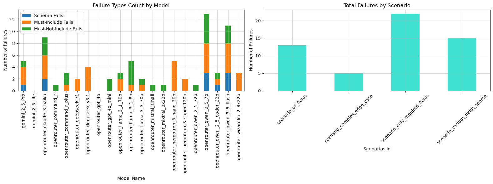
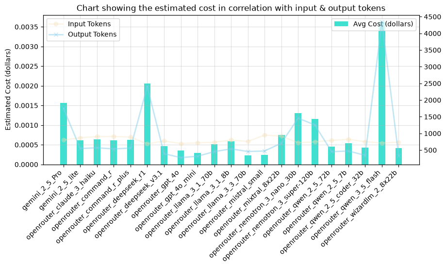
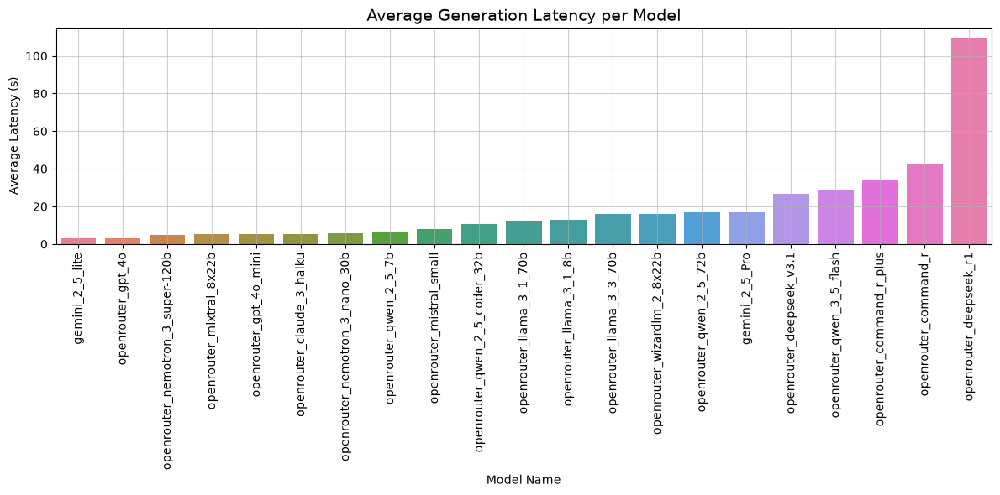
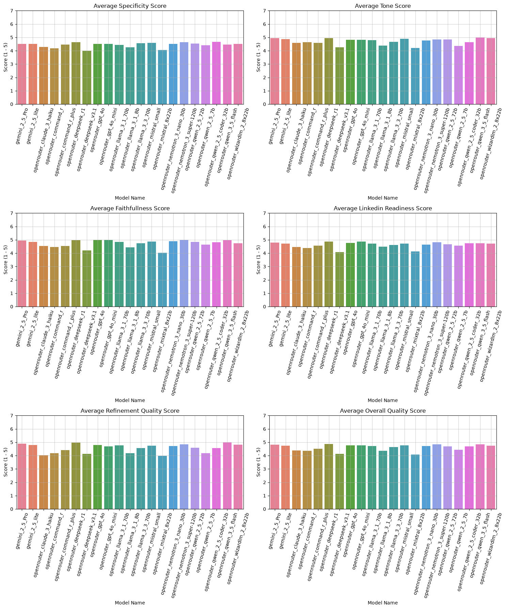

# LinkedIn Job Description GenAI

End-to-end GenAI application that turns structured intake answers into polished, LinkedIn-ready job descriptions with real-time prompt refinement, multi-provider LLM benchmarking, credit billing, and user authentication.

On a Thursday's evening, Huy and I was fiddling around on LinkedIn, realizing that most Job Description follows a specific structure. We tried generating that on some free subscription AI models and the result was not so good. So that day, `LinkedIn Job Description GenAI` was born, simply because we feel like we could do better.

Special thanks to my friend [Huy Phan, a.k.a. Hertzy](https://hertzy-da-poet.github.io/Hugo-Portfolio), for bringing the web interface into life. Hertzy implemented the entire front end and crafted the visual effects that shape the user experience.

---

## Authors & Acknowledgements

| **Phong Nguyen (Alex)** | **Huy Phan (Hertzy)** |
|:---|:---|
| **AI / LLM Engineering & Full-Stack Architecture** | **Frontend Engineering & Database Architecture** |
| Built backend, state machine, multi-provider LLM client (OpenAI, Hugging Face, OpenRouter), prompt engineering pipeline, evaluation harness, FastAPI backend, Supabase auth/DB, Stripe credit billing, and AI evaluation. | Built responsive SPA frontend using HTML5, CSS3, and Vanilla JavaScript (ES6+), integrated client-side document export (docx.js), and designed core relational database schemas in Supabase. |
| GitHub: [@AlexDaPiggie](https://github.com/AlexDaPiggie)<br>LinkedIn: [Hoai Phong Nguyen](https://www.linkedin.com/in/hoai-phong-nguyen-9367a4384/) | GitHub: [@hertzy-da-poet](https://github.com/hertzy-da-poet)<br>Portfolio: [Huy Phan Portfolio](https://hertzy-da-poet.github.io/Hugo-Portfolio/) |

---

## Key Features

- **Guided Step-by-Step Intake**: Fixed-sequence question flow captures required job details (role, responsibilities, requirements) and optional metadata (tone, perks, salary) without conversational drift.
- **Strict JSON Schema Generation**: Prompts enforce structured JSON output matching `JobDescriptionDraft` schema, rendered cleanly into Markdown.
- **Interactive Draft Refinement**: Users can request targeted edits (e.g. *"emphasize cloud infrastructure and make tone executive"*) with full schema preservation.
- **Stale State Protection**: Edits to prior intake answers set `draft_outdated = True`, locking refinement until the draft is regenerated to prevent contradictory hallucinations.
- **Comprehensive LLM Evaluation Harness**: Automated benchmarking suite testing 6+ models (`GPT-4o`, `Qwen 2.5 7B/3B/0.5B`, `Mistral 7B`, `Phi-3.5`) across Latency, Token Cost, Schema Pass Rate, Keyword Compliance, and LLM-as-a-Judge Quality Scores.
- **Production Backend & Monetization**: FastAPI with Supabase Auth (Email + Google OAuth), SlowAPI rate-limiting, and Stripe credit balance management.

---

## Architecture Pipeline
<p align="center">
  
</p>

1. **Intake & State Management (`JobAgent + SessionState`)**: User answers structured questions; required fields are validated, optional fields can be skipped or edited.
2. **Draft Generation (`build_generation_prompt`)**: Takes `JobInfo`, tone guidelines, length constraints, and passes them to the configured LLM provider.
3. **Validation & Rendering (`parse_json_markdown + MarkdownRenderer`)**: Parses and validates JSON against Pydantic schema, renders clean Markdown with standard headers (`## About the Role`, `## Responsibilities`, etc.).
4. **Targeted Refinement (`build_refinement_prompt`)**: Ingests existing draft and natural language feedback, returning an updated complete draft.
5. **Credit & Rate Control**: Deducts user credits atomically in Supabase and enforces IP-based rate limits before calling external LLMs.

---

## Tech Stack

| Layer | Technologies |
|:---|:---|
| **LLM & Prompt Engineering** | OpenAI API (`gpt-4o`, `gpt-4o-mini`), Hugging Face Inference API / Serverless (`Qwen2.5`, `Mistral-7B`, `Phi-3.5`), OpenRouter, Pydantic Schema Validation, Few-Shot Anti-Hallucination Prompting |
| **Backend & APIs** | FastAPI, Uvicorn, Python 3.11, SlowAPI (Rate Limiting) |
| **Database & Auth** | Supabase (PostgreSQL, Row-Level Security, Auth, Google OAuth) |
| **Payments & Credits** | Stripe API, Webhook Verification |
| **Evaluation Suite** | Automated Benchmark Harness (`runner.py`), LLM-as-a-Judge (`metrics.py`), Matplotlib / Jupyter Notebooks |
| **Frontend** | Vanilla JavaScript (SPA), HTML5, CSS3 |

---

## Quickstart (Run Locally)

### Prerequisites
- Python 3.11+
- API Keys: `OPENAI_API_KEY`, `HUGGINGFACE_API_KEY` (optional), `SUPABASE_URL`, `SUPABASE_KEY`, `STRIPE_SECRET_KEY`

### 1. Backend Setup

```bash
# Clone repository
git clone https://github.com/AlexDaPiggie/LinkedIn_Job_Description_GenAI.git
cd LinkedIn_Job_Description_GenAI

# Create and activate virtual environment
python -m venv venv
venv\Scripts\activate      # Windows
# source venv/bin/activate # Linux/macOS

# Install dependencies
pip install -r requirements.txt

# Configure environment variables (.env)
# OPENAI_API_KEY=your_openai_key
# SUPABASE_URL=your_supabase_url
# SUPABASE_KEY=your_supabase_key

# Run FastAPI backend
uvicorn src.api.main:app --host 0.0.0.0 --port 8000 --reload
```

- API Base URL: `http://localhost:8000`
- Swagger Docs: `http://localhost:8000/docs`

### 2. Frontend Setup

Open `front_end/index.html` directly in a browser or serve using Live Server / HTTP server:

```bash
cd front_end
python -m http.server 3000
```

---

## API Reference

### `POST /generate`
Generate a fresh job description draft from `JobInfo`.

**Request Body:**
```json
{
  "company_name": "Xavier AI",
  "role_title": "Senior ML Engineer",
  "location": "San Francisco, CA",
  "work_arrangement": "Hybrid",
  "role_summary": "Lead computer vision and foundation model deployment.",
  "responsibilities": ["Train vision models", "Optimize inference on GPU"],
  "requirements": ["5+ years PyTorch", "Experience with TensorRT"],
  "tone": "technical",
  "target_length": "medium"
}
```

**Response:**
```json
{
  "draft": {
    "title": "Senior ML Engineer - Xavier AI",
    "about_company": "Xavier AI is building cutting-edge agentic workflows...",
    "about_role": "We are seeking a Senior ML Engineer to lead vision model deployment...",
    "responsibilities": [
      "Train vision models and foundation architectures",
      "Optimize low-latency inference on serverless GPUs"
    ],
    "requirements": [
      "5+ years of production experience with PyTorch",
      "Hands-on expertise with TensorRT and ONNX Runtime"
    ],
    "nice_to_have": [],
    "benefits": [],
    "location": "San Francisco, CA (Hybrid)",
    "equal_opportunity": "Xavier AI is an Equal Opportunity Employer."
  },
  "markdown": "# Senior ML Engineer - Xavier AI\n\n## About the Role...",
  "llm_result": {
    "provider": "openai",
    "model": "gpt-4o-mini",
    "latency_seconds": 1.28,
    "input_tokens": 620,
    "output_tokens": 480,
    "estimated_cost": 0.00038
  }
}
```

### `POST /refine`
Submit natural language refinement requests on an active draft.

---

## Model Evaluation & Benchmarking

The project features an automated benchmarking suite (`src/evaluation/runner.py`) and evaluation analysis notebook ([Model_Comparison_Analysis.ipynb](file:///C:/Users/alexh/Coding/LinkedIn_Job_Description_GenAI/src/evaluation/Model_Comparison_Analysis.ipynb)) testing models across structured scenarios.

```bash
# Run benchmark across models and scenarios
python -m src.evaluation.runner
```

### 1. Schema Pass Rate & Constraint Adherence

Evaluates whether models strictly adhere to JSON schema, required keywords (`must_include`), and avoid prohibited keywords (`must_not_include`).

<p align="center">
  
</p>

* **Top Performers**: `gpt-4o` and `gemini-2.5-flash-lite` passed all test cases with 0 schema or constraint violations.
* **Minor Constraint Violations**: `mistral-small`, `qwen-2.5-72b`, `mixtral-8x22b`, and `command-r` had only 1 `must_not_include` failure.
* **Scenario Difficulty**: Scenarios with minimal inputs (Required Fields only) produced higher failure rates across weaker models compared to rich, complex prompts, showing the importance of input density for maintaining JSON structure.

### 2. Token Usage & Cost Efficiency

Measures the trade-off between input/output token consumption and cost per generation.

<p align="center">
  
</p>

* **Most Cost-Effective**: `llama-3.3-70b`, `mistral-small`, and `gpt-4o-mini` achieved the lowest cost profile while maintaining concise output length.
* **Token Efficiency**: Models like `gpt-4o-mini` generated structured drafts without token inflation, keeping API latency and expenses minimal.

### 3. Generation Latency

Measures end-to-end response time (seconds) across all test scenarios.

<p align="center">
  
</p>

* Fast, lightweight models like `gemini-2.5-flash-lite` and `gpt-4o-mini` delivered sub-2s generation times suitable for interactive applications.
* Larger open-weights models exhibited higher inference latency depending on endpoint hosting infrastructure.

### 4. LLM-as-a-Judge Quality Scores

Scores generated job descriptions on a 1–5 scale across 6 core criteria: **Specificity**, **Tone**, **Faithfulness**, **LinkedIn Readiness**, **Refinement Quality**, and **Overall Quality**.

<p align="center">
  
</p>

* **Overall Quality**: `gpt-4o` and `gemini-2.5-flash-lite` scored highest across LinkedIn readiness and tone fidelity.
* **Faithfulness & Specificity**: Larger models showed lower hallucination rates, preserving exact intake parameters without inventing false company perks or responsibilities.


---

## Repository Structure

```
LinkedIn_Job_Description_GenAI/
├── docs/                       # Architecture diagrams & documentation
├── eval_results/               # Automated benchmark CSVs & analysis notebooks
├── front_end/                  # Frontend UI (HTML, CSS, JS)
├── src/
│   ├── agent/
│   │   ├── job_agent.py        # Orchestration for generation & refinement
│   │   ├── parser.py           # JSON parsing & validation helpers
│   │   ├── prompts.py          # System & user prompt templates
│   │   ├── questions.py        # Intake questions definition & skip logic
│   │   └── state.py            # SessionState & QuestionAnswer data classes
│   ├── api/
│   │   ├── main.py             # FastAPI entrypoint, auth, stripe & endpoints
│   │   ├── schemas.py          # Request / Response Pydantic models
│   │   └── services.py         # Business logic connectors
│   ├── auth/                   # Supabase authentication & Google OAuth verifier
│   ├── database/               # Supabase PostgreSQL client & credit queries
│   ├── evaluation/
│   │   ├── metrics.py          # Schema validation, cost calculation & judge
│   │   ├── runner.py           # Benchmark test harness
│   │   └── scenarios.py        # Test cases across diverse industry roles
│   ├── llm/
│   │   ├── client.py           # Unified client interface
│   │   ├── models.py           # Supported models configuration
│   │   └── providers.py        # Provider adapters (OpenAI, HF, OpenRouter)
│   ├── rendering/
│   │   └── markdown_renderer.py # JSON-to-Markdown renderer
│   └── schema/
│       ├── job_description.py  # JobDescriptionDraft Pydantic model
│       └── job_info.py         # JobInfo input schema
├── pyproject.toml              # Project metadata
├── requirements.txt            # Python dependencies
└── README.md                   # Project overview
```
