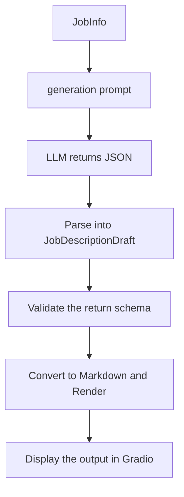

# Project Architecture 

## Objective
An LLM model able to generate job description on Linked In from user input. The UI should be user-friendly, allowing things like refining prompts (user inputs), regenerate draft vesion, and skipping questions. In order to avoid overengineer, these questions should be asked in a specified sequence, and agent should not choose the next question. The logic is: Ask the next question if it's not marked as skipped or answered. So, how should we build the structure of object and schema to allow these features ? 

In order to allow changing version of the answer, we have to build a structured state for the objects, allowing to udpate the newest version, and canceling the previous states. If not, the model is likely to get into the trap of refining all previous drafts, making the system token-expensive.

# UX
The final version should be hosted with a customized UI on a supporting platform. However, the initital versions should rather be a Gradio. For now, the most simple & effective design should be: 

1. Question panel:
    * Shows the questions to the user
    * Accept the answer from user
    * A submit button to turn in the answer
    * A skip button for questions that can be skippped

2. Review Answers panel:
    * Shows all answered and skipped questions
    * Let the users select a previous question from a dropdown (if they want to refine)
    * Load their current answer to an editable textbox
    * Save the updated answer back into the structured state 

3. Generated Job Description Panel
    * Shows the rendered Markdown description
    * 'generate' or 'regenerate' button to convert all the changes into a new markdown descrition
    * Refinement should be blocked when the draft has been outdated (this prevents the model from confusing the input data and refine all versions (token-expensive))


# Input Data Flow
The agent asks one question at a time using a fixed question sequence. Required questions cannot be skipped. Optional questions can be skipped and later edited from Review Answers panel. The question set should be as follow:


    Required: 
        * Company name
        * Role title
        * Location and work arrangement
        * Main purpose of the role
        * Main responsibilities
        * Required skills  qualifications

    Optional:
        * Company description
        * Nice-to-have skills / qualifications
        * Benefits and perks
        * Salary range 
        * Tone (the vibe of the job description)
        * Target length (how long should the descrition be)

The MVP should not require LLM-driven question selection (which is not that necessary and takes lots of testing. HOWEVER, this feature is worth experimenting in the future)

## State Model 
We should have the following objects to allow the objective to be implemented: 

```python 
Job Info:
    company_name: str
    role_title: str
    location: str
    work_arangement: str
    role_summary: str
    responsibilities: list[str]
    requirements: list[str]
    company_descriptions: str | None
    nice_to_haves: list[str]
    benefits: list[str]
    salary_range: str | None
    tone: str
    target_length: str

QuestionAnswer:
    question_id: str
    field_name: str
    question_text: str
    answer_text: str | None
    status: "answered" | "skipped"

JobDescriptionDraft: 
    title: str
    about_company: str
    about_role: str
    responsibilities: list[str]
    requirements: list[str]
    nice_to_have: list[str]
    benefits: list[str]
    location: str
    equal_opportunity: str

SessionState: 
    job_info: JobInfo
    answers: dict[str, QuestionAnswer]
    question_index: int
    current_draft_json: JobDescriptionDraft | None
    current_draft_markdown: str | None
    draft_outdated: bool
```
If the user edits an answer after a draft exists, the app updates JobInfo and sets draft_outdated = True. Then, the current draft will remain visible but cannot be refined until user regenerates it. 

**NOTE**: When implement the customized UI, we should also add a line saying that: "You have to regenerate before you can refine again"

## Draft Generation
The model should return JSON matching JobDescriptionDraft. The app will then have to validate the JSON and render it to Markdown



The markdown structure should follow this structure 
```text
# {title}

## About the Company

## About the Role

## Responsibilities

## Requirements

## Nice to Have

## Benefits

## Location / Work Arrangement

## Equal Opportunity Statement
```


## Generation Prompt
I am quite confused with the prompt for now. This may need to be improved in the future for better output performance. 

Generally, the set of prompts should provide the model with information about: 

* Structured job info
* Required JSON schema
* Section-by-section writing guidance
* Tone and target lenght instructions
* Rules against inventing unsupported facts 

The prompts should guide the model with core generation behaviors:
* Expand short user answers to polished job-description language
* Preserve factual details from JobInfo
* Do NOT invent salary, benefits, location, tools, company facts, or requirements
* Use generational language when optional information is missing
* produce specific, professional, LinkedIn-ready content

Lengh guidance: 
* Short: under 500 w after rendering
* Medium: ~600 - 900 w
* Long: ~900 - 1200 w 

The tone guidance should be mapped from a simpler user choices such as professional friendly, startup-like, technical, executive, conse, or detailed 

**Note** For tone guidance, the customized UI should instruct users of keywords they can include. Also, if no informatino was provided, there should be a default set of tone for the model.


## Refinement Data Flow
Refinement should use the latest JobInfo, the current JobDescriptionDraft, and the user's refinement request

The pipeline should be: 
```text
JobInfo + Current JobDescriptionDraft + user request
-> refinement prompt 
-> LLM returns revised JSON
-> parse into JobDescriptionDraft
-> validate schema
-> render Markdown
-> display updated draft
```

Refinement rules:
* Return the full revised JSON draft, not only the changed section
* Preserve the unchanged facts
* Do not introduce unsupported claims
* Keep same schema

If draft_outdated = True, refinement should be blocked with a message telling the user to regenerate the draft first.

LLM Evaluation ?
This could be implemented after the data 